```{r, include = FALSE, eval=FALSE}
### <!-- "`r rbbt::bbt_write_bib('zotero.bib', overwrite = TRUE, library_id=rbbt::bbt_library_id('CSAFE'))`" -->
```

```{r setup, include=FALSE, cache=FALSE}
knitr::opts_chunk$set(echo = TRUE, cache=TRUE)
if (!require(fastDummies)) install.packages('fastDummies')
if (!require(tidyverse)) install.packages('tidyverse')
if (!require(ggplot2)) install.packages('ggplot2')
if (!require(RColorBrewer)) install.packages('RColorBrewer')
if (!require(ggpubr)) install.packages('ggpubr')
if (!require(yardstick)) install.packages('yardstick')
if (!require(x3ptools)) install.packages('x3ptools')
library(fastDummies)
library(tidyverse)
library(ggplot2)
library(RColorBrewer)
library(ggpubr)
library(yardstick)
library(x3ptools)
theme_set(theme_bw())
## Load Functions - eventually we would like to just load a library

source("../R/comparison.R")

colorize <- function(x, color) {
  if (knitr::is_latex_output()) {
    sprintf("\\textcolor{%s}{%s}", color, x)
  } else if (knitr::is_html_output()) {
    sprintf("<span style='color: %s;'>%s</span>", color,
      x)
  } else x
}

hh <- function(x) {
  colorize(x, "darkorange")
}

nv <- function(x) {
  colorize(x, "chartreuse3")
}

co <- function(x) {
  colorize(x, "red")
}
```

```{r data, echo=FALSE, cache=TRUE}
full_data = read.csv(file = "../data/std_and_cropped_data_12_20_2022.csv", header=TRUE)

# some prepping
full_data = full_data %>% mutate(
  Quality = factor(Quality, levels=c("Good", "Tiny Problems", "Problematic", "Bad", "Yikes")),
  Problem = factor(Problem),
  GoodScan = Quality %in% c("Good", "Tiny Problems") %>% factor(),
  LAPD_id = sprintf("FAU%3d-B%s-L%d",FAU, Bullet, Land)
)

followupScans <- data.frame()
```


# Comparison of features on Full and Cropped Scans

@nationalresearchcouncilu.s.StrengtheningForensicScience2009

### Abstract

Deciding if a scan's quality is often difficult, and time consuming if a scan needs to be redone. The scanner, often not familiar with the statistical processes to follow, needs an evaluater to consider each scan's quality before it leaves the microscope mount. We propose using the X3P scan quality indicator, and in this comparative analysis, we evaluate four of the features used to determine if a scan is of sufficient quality. We found that two of the features give superior results when calculated on a cropped version of an image, one of them is impartial to cropped or full image, and the last feature is best ran over the full image. 

To conduct our analysis, we did a series of tests to compare the cropped version of a scan against the full version. We constructed scatter and box plots as well as ROC curves for visual analysis We trained a Generalized Linear Model (glm) to test the p scores, or importance, of each variable in the model, and constructed kernel density graphs to compare the scans. Every cropped scan and its full scan counterpart were found to have more than 90% correlation with each other, requiring us to use only one of them for each feature to avoid co-linearity issues.

[Extract NA](#extract-na), a measure of the total missing value count in the scan over the total value count. This feature performed better when it is cropped with no reservations. The ROC curve and p score in the glm were both better for the cropped image. The kernel density graph was also more distinct for the cropped image. 

[Assess Bottomempty](#assess-bottomempty), a measure of missing value count in the bottom 20% of the scan compared to the total value count in the same area. This feature performed better when it is cropped with no reservations. The ROC curve and p score in the glm were both better for the cropped image. The kernel density graph was also more distinct for the cropped image. 

[Assess Col NA](#assess-col-na), the proportion of columns in the scans matrix which have more than 20% missing values. This feature performed only marginally better when cropped. The ROC area difference is only 0.008, and the p scores for both features were found to be extremely significant. The kernal density graphs are very similar with the cropped graph being slightly more distinct.

[Assess Median NA Proportion](#assess-median-na-proportion), calculates the mean number of NA's in each column, and then finds the median out of all those values. This feature performed better when left as the full scan. The ROC area for the cropped was better by only 0.001, the p values for both features were found to be extremely significant, but the full scan was lower. The kernel density graph was more distinct for the full images. 

```{r, echo = FALSE}
feature_table <- data.frame(matrix(nrow = 4, ncol=5, dimnames=list(c("Extract NA", "Assess Bottomempty", "Assess Col NA", "Assess Median NA Proportion"), c("Correlation", "pvalue_Full", "pvalue_cropped", "auc_Full", "auc_Cropped"))))

feature_table[1,] <- c(0.908, "0.229", "<2e-16", 0.871, 0.902)
feature_table[2,] <- c(0.905, "5.86e-10", "<2e-16", 0.783, 0.859)
feature_table[3,] <- c(0.919, "1.62e-06", "1.17e-14", 0.888, 0.896)
feature_table[4,] <- c(0.908, "<2e-16", "6.77e-10", 0.907, 0.863)

knitr::kable(feature_table)
```

All of the features had significant outliers, which we have called "[Followup Scans](#followup-scans)", for their individual predictive power. We investigated the type I errors, false positives of a bad scan being predicted as good, and found them all to be "Tiny Problems" scans which could reasonably be re-classified as "problematic" or worse.

XXX Related Works
- `r co("Do we need forensics specific papers here, or can we use general imagery comparative analysis?")`  


## Background and Introduction

XXX General stylistic comments

- `r hh("there are no 'you's in a scientific paper. Make sure to be specific of each actor.")`  

Relevant citations for criticism of the subjective nature of current firearms comparisons:
[@presidentscouncilofadvisorsonscienceandtechnologyForensicScienceCriminal2016; 
@nationalresearchcouncilu.s.StrengtheningForensicScience2009]

@presidentscouncilofadvisorsonscienceandtechnologyForensicScienceCriminal2016,  
@nationalresearchcouncilu.s.StrengtheningForensicScience2009

XXX Writing in progress
- `r co("Some questions on this section, am I being too generic? Do I need to add more sources in this section?")`  


In many court cases, determining the source of evidence is crucial, whether it is finding the correct murder weapon, or proving which cartridge casing came from which firearm. The particular evidence of interest to this study is determining if a bullet is fired from a particular firearm. 

Currently, the method used to determine if a specific bullet came from a specific firearm requires you to have the bullet, preferably as undamaged as possible, and the firearm. You would fire the weapon into a kevlar tube so that you have a second bullet to use as your control, that you know came from the firearm. Most modern firearms have rifling, which is a series of spiral grooves in a barrel that cause the bullet to spin, leading to greater speed, accuracy, and range. Rifling is done via mass production, but due to very small inconsistencies, and the use and treatment of the barrel after production, the rifling leaves unique grooves on the bullets that are individually identifiable[- `r co("[3]")`] to the particular barrel. The grooves on the bullets are called striations and the general pattern is similar across all bullets fired from a particular barrel. Two main flaws in this method are that barrels are usually interchangeable on firearms, and that continued firing from the barrel will alter the chance of a match.

Forensic Examiners are the current standard for comparing if two bullets have sufficient striation matching to be considered a positive match. A forensic examiner is a person who uses a comparison microscope to view two of the bullets and their striations and matches them. The problem with using forensic examiners is that they are still subjective[Report to the president], and have been proven to have higher than a 1% error rate[- `r co("Miami and Ames studies respectively, [1]")`]. 

To further aid in forensic abilities and quantitative methods, CSAFE has been researching ways to use machine learning and other methods to automatically and quantitatively compare bullet striation marks.[- `r co("[2]")`], which compares bullets using a variety of statistical and mathematical models to generate confidence scores of the similarities of striation markings. Automated methods and forensic examiners alike have a similar issue that this paper will hereby address. The problem is quality of microscopy scan quality. In order to compare the scans, each bullet must be under a microscope and a digital scan must be made. Scanning of the bullets can go wrong in a variety of ways, from lighting conditions, bullet placement in the holders, to actual damage to the bullets surface. In order to detect when there are flaws in the scanning process, we have created an RShiny app that reads in the scanned X3P files, and gives a confidence score, with 100 being a perfect, un-flawed scan, to 0 being a terrible scan. 

To increase the speed and performance of our quality scanner, we decided to crop the X3P files, this helps eliminate the 'noise' around the images that can skew the accuracy of the results. By using smaller images, we also increase the speed of evaluation, as there is less to process. 

This analysis is to compare the difference between the cropped versus non-cropped (full) version of a scan for quality identification. Cropped images have the potential for decreasing noise around the signal. The level of cropping we are considering is 5% from the left and right sides, and 10% off of the top of the image. In particular, we want to preserve the bottom of the image and the center as that is where most of the signal is. Below are examples of a full, full with marked edges, and a cropped image.

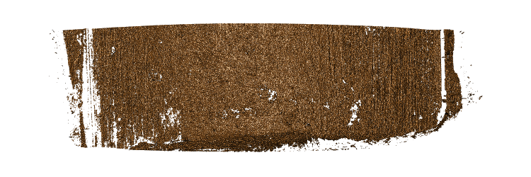

- `r co("Is this the kind of image you were imagining? I think we need to make the red lines beefier and more obvious")`  

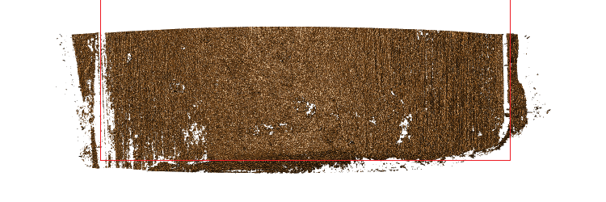


## Features

Each of the features shares a similar set up, so the following assumptions and definitions will remain independently true for each of the features defined below.

Let $A=\{NA\}$ be the set of undefined values. For simplicity of notation we will assume that the space of real values ${\rm I\!R}$ contains $A$:
${\rm I\!R}:= {\rm I\!R} \cup A$. 

Let $X \in R^{m,n}$ be a real-valued surface matrix of dimensions m x n where m and n are strictly positive integers $X = (x_{ij})_{1 \leq i \leq m, 1 \leq j \leq n}$.


[Extract NA](#extract-na)

The function `extract_na` calculates the percentage of missing values in the scan (part) under observation, e.g. for scan surface matrix $X \in {\rm I\!R}^{m, n}$ the percentage of missing values is defined as:

The proportion of missing values in X is then defined as: 
$$
\frac{1}{m*n} \sum^m_{i=1} \sum^n_{j=1} \theta_A(x_{ij}) \\
\text{Where } \theta_A(x) = \left\{\begin{aligned}
&1 &&: \text{if }x \in A\\
&0 &&: \text{otherwise}\\
\end{aligned} \right.
$$
[Assess Bottomempty](#assess-bottomempty)

The feature `assess_bottomempty` calculates the percentage of missing values in the bottom 20% of the scan. 

Let $R \subseteq {\rm I\!R}$ be a set of size m, where each element is the sum of the NA's for the given row, defined as:
$$
\forall i \in R: R_i = \sum^n_{j=1} \theta_A(x_{ij}) \\
\text{Where } \theta_A(x) = \left\{\begin{aligned}
&1 &&: \text{if }x \in A\\
&0 &&: \text{otherwise}\\
\end{aligned} \right.
$$

Let $B \subset R$ be a set, which is the set of all values in $R_i$, given that $i \geq m*0.8$. Therefore, the proportion of missing values in $X$'s bottom 20% can be given by:
$$
\frac{1}{m*n*0.2}\sum_{i=1}^{m*0.2}(R_i)*100
$$
[Assess Col NA](#assess-col-na)

The function `assess_col_na` is the proportion of columns in the image matrix which have more NA's than 20%.

For every column in the matrix of a scan, we find the proportion of scans in that column which are NA. Then we count how many of the columns whose proportion is greater than 20%, the pre-determined threshold of acceptable NA's. Then we divide by the number of columns * 0.2 to get our final threshold adjusted number. 

Let $R \subseteq {\rm I\!R}$ be a set of size n, where each element is the sum of the NA's for the given column, defined as:
$$
\forall i \in R: R_i = \sum^m_{j=1} \theta_A(x_{ij}) \\
\text{Where } \theta_A(x) = \left\{\begin{aligned}
&1 &&: \text{if }x \in A\\
&0 &&: \text{otherwise}\\
\end{aligned} \right.
$$

We define $P$ as the proportion of all NAs per column for every row, as defined here:
$$
\forall i \in R: P_i = \frac{R_i}{n} * 100
$$

We now find the proportion of threshold adjusted columns in the matrix 
$$
\frac{\sum_{i=1}^n(P_i*\beta_B(P_i))}{n*0.2} \\
\text{Where } \beta_B(x) = \left\{\begin{aligned}
&1 &&: \text{if }x > 20\\
&0 &&: \text{otherwise}\\
\end{aligned} \right.
$$

[Assess Median NA proportion](#assess-median-na-proportion)

The function `assess_median_na_proportion` calculates the mean number of NA's in each column, and then finds the median out of all those values.

Let $R \subseteq {\rm I\!R}$ be a set of size n, where each element is the mean of the NA's for the given column, defined as:
$$
\forall i \in R: R_i = \frac{\sum^m_{j=1} \theta_A(x_{ij})}{m} \\
\text{Where } \theta_A(x) = \left\{\begin{aligned}
&1 &&: \text{if }x \in A\\
&0 &&: \text{otherwise}\\
\end{aligned} \right.
$$

We then sort, and select the median of $R$

## Appendix

### Extract NA

#### Which of the features is better for discriminating between good and bad scans?

```{r echo=FALSE}
correlation <- cor(full_data$extract_na, full_data$extract_na_cropped)

res <- comparison(data.frame(full_data$extract_na, full_data$extract_na_cropped, full_data$Quality), feature = "Extract NA")

res$scatterplot + coord_equal()

res$boxplot

res$roc_curve

print(paste("Extract NA. Correlation: ", round(correlation, 3), "Full AUC:", round(res$roc_auc$Full_AUC, 3), "Cropped AUC: ", round(res$roc_auc$Cropped_AUC, 3)))

knitr::kable(res$summ, caption=attr(res$summ, "title"))

```
#### Should we use features from just one type of scan or both?

```{r, echo=FALSE}
# logistic regression in the two features
logistic_base <- glm(GoodScan~extract_na+extract_na_cropped, data = full_data, family = binomial())
summary(logistic_base)

# extract_na_cropped is the better single predictor. 
full_data %>% pivot_longer(starts_with("extract_na"), names_to="Scan") %>% 
  ggplot(aes(x = value, fill=GoodScan, color=GoodScan)) +
  geom_density(alpha=0.8) +
  scale_fill_manual(values=col_scans_light) +
  scale_colour_manual(values=col_scans_dark) +
  facet_grid(.~Scan)

```


#### Conclusion for Extract NA

The values for feature `extract_NA` are highly correlated between the cropped and the full scan. 

Using good and scans with only tiny problems as overall 'good' scans, the feature applied to cropped scans has an increased accuracy compared to the feature values from the full scan. 

We might want to follow up on the orange colored scans:

```{r echo=FALSE, fig.height=3}
full_data  <- full_data %>% 
  mutate(followup=GoodScan=="TRUE" & extract_na_cropped>15)
full_data %>% 
  ggplot(aes(x = extract_na_cropped, y = GoodScan, color = followup)) + 
  geom_jitter() +
  scale_colour_manual(values=c("grey50", "darkorange"))


```
```{r}

full_data$LAPD_id[full_data$followup]

followupScans <- rbind(followupScans, full_data[full_data$followup == TRUE,])
# All followups for extract_na are mislabelled scans. They are all labelled as tiny problems but should be problematic or worse.
```

```{r, include = FALSE, eval = FALSE}
library(x3ptools)
# /media/Raven/LAPD
f1 <- x3p_read("/media/Raven/LAPD/FAU 263/Bullet A/LAPD - 263 - Bullet A - Land 4 - Sneox2 - 20x - auto light left image + 20% - threshold 2 - resolution 4 - Connor Hergenreter.x3p")
# FAU263-BA-L4 is labelled tiny-problems but should be labelled Problematic or worse

f2 <- x3p_read("/media/Raven/LAPD/FAU 263/Bullet C/LAPD - 263 - Bullet C - Land 1 - Sneox2 - 20x - auto light left image + 20% - threshold 2 - resolution 4 - Connor Hergenreter.x3p")
# FAU263-BC-L1 is labelled tiny-problems but should be labelled Problematic or worse

f3 <- x3p_read("/media/Raven/LAPD/FAU 263/Bullet C/LAPD - 263 - Bullet C - Land 3 - Sneox2 - 20x - auto light left image + 20% - threshold 2 - resolution 4 - Connor Hergenreter.x3p")
# FAU263-BC-L3 is labelled tiny-problems but should be labelled Problematic or worse

f4 <- x3p_read("/media/Raven/LAPD/FAU 287/Bullet C/LAPD - 287 - Bullet C - Land 5 - Sneox1 - 20x - auto light left image + 20% - threshold 2 - resolution 4 - Connor Hergenreter.x3p")
# FAU287-BC-L5 is labelled tiny-problems but should be labelled Problematic or worse

f5 <- x3p_read("/media/Raven/LAPD/FAU 154/Bullet D/LAPD - 154 - Bullet D - Land 2 - Sneox2 - 20x - auto light left image + 20% - threshold 2 - resolution 4 - Carley McConnell.x3p")
# FAU154-BD-L2 is labelled tiny-problems but should be labelled Problematic or worse

f6 <- x3p_read("/media/Raven/LAPD/FAU 277/Bullet A/LAPD - 277 - Bullet A - Land 4 - Sneox2 - 20x - auto light left image + 20% - threshold 2 - resolution 4 - Connor Hergenreter.x3p")
# FAU277-BA-L4 is labelled tiny-problems but should be labelled Problematic or worse

f7 <- x3p_read("/media/Raven/LAPD/FAU 286/Bullet A/LAPD - 286 - Bullet A - Land 5 - Sneox1 - 20x - auto light left image + 20% - threshold 2 - resolution 4 - Connor Hergenreter.x3p")
# FAU286-BA-L5 is labelled tiny-problems but should be labelled Problematic or worse
```


### Assess Bottomempty

#### Which of the features is better for discriminating between good and bad scans?

```{r echo=FALSE}
correlation <- cor(full_data$assess_bottomempty, full_data$assess_bottomempty_cropped)

res <- comparison(data.frame(full_data$assess_bottomempty, full_data$assess_bottomempty_cropped, full_data$Quality), feature = "Assess Bottomempty")
res$scatterplot + coord_equal()

res$boxplot

res$roc_curve

print(paste("Assess Bottomempty. Correlation: ", round(correlation, 3), "Full AUC:", round(res$roc_auc$Full_AUC, 3), "Cropped AUC: ", round(res$roc_auc$Cropped_AUC, 3)))

knitr::kable(res$summ, caption=attr(res$summ, "title"))

```
#### Should we use features from just one type of scan or both?

```{r, echo=FALSE}
# logistic regression in the two features
logistic_base <- glm(GoodScan~assess_bottomempty+assess_bottomempty_cropped, data = full_data, family = binomial())
summary(logistic_base)

# assess_bottomempty_cropped is the better single predictor. 
full_data %>% pivot_longer(starts_with("assess_bottomempty"), names_to="Scan") %>% 
  ggplot(aes(x = value, fill=GoodScan, color=GoodScan)) + geom_density(alpha=0.8) + scale_fill_manual(values=col_scans_light) + scale_colour_manual(values=col_scans_dark) +
  facet_grid(.~Scan)
```


#### Conclusion for Assess Bottomempty

The values for feature `assess_bottomempty` are highly correlated between the cropped and the full scan. 

Using good and scans with only tiny problems as overall 'good' scans, the feature applied to cropped scans has an increased accuracy compared to the feature values from the full scan. 

We might want to follow up on the orange colored scans:

```{r echo=FALSE, fig.height=3}
full_data  <- full_data %>% 
  mutate(followup=GoodScan=="TRUE" & assess_bottomempty_cropped>30)
full_data %>% 
  ggplot(aes(x = assess_bottomempty_cropped, y = GoodScan, color = followup)) + 
  geom_jitter() +
  scale_colour_manual(values=c("grey50", "darkorange"))
```
```{r}
full_data$LAPD_id[full_data$followup]

followupScans <- rbind(followupScans, full_data[full_data$followup == TRUE,])
```

```{r, include = FALSE, eval = FALSE}
# All problems are registered as tiny problems
followup <- c("FAU263-BA-L4", "FAU287-BC-L5", "FAU254-BD-L4", "FAU275-BC-L5", "FAU275-BD-L3", "FAU277-BA-L4", "FAU286-BA-L5")
f1 <- x3p_read("/media/Raven/LAPD/FAU 263/Bullet A/LAPD - 263 - Bullet A - Land 4 - Sneox2 - 20x - auto light left image + 20% - threshold 2 - resolution 4 - Connor Hergenreter.x3p")
image(f1, main=followup[1])

f2 <- x3p_read("/media/Raven/LAPD/FAU 287/Bullet C/LAPD - 287 - Bullet C - Land 5 - Sneox1 - 20x - auto light left image + 20% - threshold 2 - resolution 4 - Connor Hergenreter.x3p")
image(f2, main=followup[2])

f3 <- x3p_read("/media/Raven/LAPD/FAU 254/Bullet D/LAPD - 254 - Bullet D - Land 4 - Sneox2 - 20x - auto light left image +20% - threshold 2 - resolution 4 - Connor Hergenreter.x3p")
image(f3, main=followup[3])

f4 <- x3p_read("/media/Raven/LAPD/FAU 275/Bullet C/LAPD - 275 - Bullet C - Land 5 - Sneox2 - 20x - auto light left image + 20% - threshold 2 - resolution 4 - Connor Hergenreter.x3p")
image(f4, main=followup[4])

f5 <- x3p_read("/media/Raven/LAPD/FAU 275/Bullet D/LAPD - 275 - Bullet D - Land 3 - Sneox2 - 20x - auto light left image + 20% - threshold 2 - resolution 4 - Connor Hergenreter.x3p")
image(f5, main=followup[5])

f6 <- x3p_read("/media/Raven/LAPD/FAU 277/Bullet A/LAPD - 277 - Bullet A - Land 4 - Sneox2 - 20x - auto light left image + 20% - threshold 2 - resolution 4 - Connor Hergenreter.x3p")
image(f6, main=followup[6])

f7 <- x3p_read("/media/Raven/LAPD/FAU 286/Bullet A/LAPD - 286 - Bullet A - Land 5 - Sneox1 - 20x - auto light left image + 20% - threshold 2 - resolution 4 - Connor Hergenreter.x3p")
image(f7, main=followup[7])

```


### Assess Col NA

#### Which of the features is better for discriminating between good and bad scans?

```{r echo=FALSE}
correlation <- cor(full_data$assess_col_na, full_data$assess_col_na_cropped)

res <- comparison(data.frame(full_data$assess_col_na, full_data$assess_col_na_cropped, full_data$Quality), feature = "Assess Col NA")

res$scatterplot + coord_equal()

res$boxplot

res$roc_curve

print(paste("Assess Col NA Correlation: ", round(correlation, 3), "Full AUC:", round(res$roc_auc$Full_AUC, 3), "Cropped AUC: ", round(res$roc_auc$Cropped_AUC, 3)))

knitr::kable(res$summ, caption=attr(res$summ, "title"))

```
#### Should we use features from just one type of scan or both?

```{r, echo=FALSE}
# logistic regression in the two features
logistic_base <- glm(GoodScan~assess_col_na+assess_col_na_cropped, data = full_data, family = binomial())
summary(logistic_base)

# Both predictors are about the same.
full_data %>% pivot_longer(starts_with("assess_col_na"), names_to="Scan") %>% 
  ggplot(aes(x = value, fill=GoodScan, color=GoodScan)) + geom_density(alpha=0.8) + scale_fill_manual(values=col_scans_light) + scale_colour_manual(values=col_scans_dark) +
  facet_grid(.~Scan)
```


#### Conclusion for Assess Col NA

The values for feature `assess_col_na` are highly correlated between the cropped and the full scan. 

Using good and scans with only tiny problems as overall 'good' scans, the feature applied to cropped scans has an increased accuracy compared to the feature values from the full scan. 

We might want to follow up on the orange colored scans:

```{r echo=FALSE, fig.height=3}
full_data  <- full_data %>% 
  mutate(followup=GoodScan=="TRUE" & assess_col_na_cropped>1.35)
full_data %>% 
  ggplot(aes(x = assess_col_na_cropped, y = GoodScan, color = followup)) + 
  geom_jitter() +
  scale_colour_manual(values=c("grey50", "darkorange"))
```
```{r}
full_data$LAPD_id[full_data$followup]

followupScans <- rbind(followupScans, full_data[full_data$followup == TRUE,])
```

```{r, include = FALSE, eval = FALSE}
followup <- data.frame(LAPD_ID = c("FAU263-BA-L4", "FAU263-BB-L3", "FAU263-BC-L1", "FAU263-BC-L3", "FAU154-BD-L2", "FAU286-BA-L5"), filePAth = c("/media/Raven/LAPD/FAU 263/Bullet A/LAPD - 263 - Bullet A - Land 4 - Sneox2 - 20x - auto light left image + 20% - threshold 2 - resolution 4 - Connor Hergenreter.x3p", "/media/Raven/LAPD/FAU 263/Bullet B/LAPD - 263 - Bullet B - Land 3 - Sneox2 - 20x - auto light left image + 20% - threshold 2 - resolution 4 - Connor Hergenreter.x3p", "/media/Raven/LAPD/FAU 263/Bullet C/LAPD - 263 - Bullet C - Land 1 - Sneox2 - 20x - auto light left image + 20% - threshold 2 - resolution 4 - Connor Hergenreter.x3p", "/media/Raven/LAPD/FAU 263/Bullet C/LAPD - 263 - Bullet C - Land 3 - Sneox2 - 20x - auto light left image + 20% - threshold 2 - resolution 4 - Connor Hergenreter.x3p", "/media/Raven/LAPD/FAU 154/Bullet D/LAPD - 154 - Bullet D - Land 2 - Sneox2 - 20x - auto light left image + 20% - threshold 2 - resolution 4 - Carley McConnell.x3p"  , "/media/Raven/LAPD/FAU 286/Bullet A/LAPD - 286 - Bullet A - Land 5 - Sneox1 - 20x - auto light left image + 20% - threshold 2 - resolution 4 - Connor Hergenreter.x3p"))

for (i in 1:nrow(followup)) {
  f <- x3p_read(followup[i,2])
  image(f, main=followup[i,1])
}
```

### Assess Median NA Proportion

#### Which of the features is better for discriminating between good and bad scans?

```{r echo=FALSE}
correlation <- cor(full_data$extract_na, full_data$extract_na_cropped)


res <- comparison(data.frame(full_data$assess_median_na_proportion, full_data$assess_median_na_proportion_cropped, full_data$Quality), feature = "Assess median NA proportion")

res$scatterplot + coord_equal()

res$boxplot

res$roc_curve

print(paste("Assess Median NA Proportion. Correlation: ", round(correlation, 3), "Full AUC:", round(res$roc_auc$Full_AUC, 3), "Cropped AUC: ", round(res$roc_auc$Cropped_AUC, 3)))

knitr::kable(res$summ, caption=attr(res$summ, "title"))

```
#### Should we use features from just one type of scan or both?

```{r, echo=FALSE}
# logistic regression in the two features
logistic_base <- glm(GoodScan~assess_median_na_proportion+assess_median_na_proportion_cropped,
                     data = full_data, family = binomial())
summary(logistic_base)

# assess_median_na_proportion is the better single predictor. 
full_data %>% pivot_longer(starts_with("assess_median_na_proportion"), names_to="Scan") %>% 
  ggplot(aes(x = value, fill=GoodScan, color=GoodScan)) + geom_density(alpha=0.8) + scale_fill_manual(values=col_scans_light) + scale_colour_manual(values=col_scans_dark) +
  facet_grid(.~Scan)
```


#### Conclusion for Assess Median NA Proportion

The values for feature `extract_NA` are highly correlated between the cropped and the full scan. 

Using good and scans with only tiny problems as overall 'good' scans, the feature applied to full scans has an increased accuracy compared to the feature values from the cropped scan. 

We might want to follow up on the orange colored scans:

```{r echo=FALSE, fig.height=3}
full_data  <- full_data %>% 
  mutate(followup=GoodScan=="TRUE" & assess_median_na_proportion>0.095)
full_data %>% 
  ggplot(aes(x = assess_median_na_proportion, y = GoodScan, color = followup)) + 
  geom_jitter() +
  scale_colour_manual(values=c("grey50", "darkorange"))
```
```{r}
full_data$LAPD_id[full_data$followup]

followupScans <- rbind(followupScans, full_data[full_data$followup == TRUE,])
```
```{r, include = FALSE, eval = FALSE}
followup <- data.frame(LAPD_ID = c("FAU263-BC-L3", "FAU154-BD-L2", "FAU204-BC-L4"), filePAth = c("/media/Raven/LAPD/FAU 263/Bullet C/LAPD - 263 - Bullet C - Land 3 - Sneox2 - 20x - auto light left image + 20% - threshold 2 - resolution 4 - Connor Hergenreter.x3p", "/media/Raven/LAPD/FAU 154/Bullet D/LAPD - 154 - Bullet D - Land 2 - Sneox2 - 20x - auto light left image + 20% - threshold 2 - resolution 4 - Carley McConnell.x3p", "/media/Raven/LAPD/FAU 204/Bullet C/LAPD - 204 - Bullet C - Land 4 - Sneox1 - 20x - auto light left image + 20% - threshold 2 - resolution 4 - Connor Hergenreter.x3p"))

for (i in 1:nrow(followup)) {
  f <- x3p_read(followup[i,2])
  image(f, main=followup[i,1])
}
# all should be relabbeled, FAU 204, BC, L4 is particularly Yikes looking
```

### Followup Scans

```{r}
followupUnique <- followupScans[duplicated(followupScans) == FALSE,]
followupScans %>% group_by(followupScans$LAPD_id) %>% summarize(
  count = n()
)

# 3 hits: FAU154-BD-L2, FAU263-BA-L4, FAU263-BC-L3, FAU286-BA-L5
# 2 hits: FAU263-BC-L1, FAU277-BA-L4, FAU287-BC-L5
# 1 hits: FAU204-BC-L4, FAU254-BD-L4, FAU263-BB-L3, FAU275-BC-L5, FAU275-BD-L3
```

```{r, eval=FALSE}
FAU263_BA_L4 <- x3p_read("../data/followup_scans/LAPD - 263 - Bullet A - Land 4 - Sneox2 - 20x - auto light left image + 20% - threshold 2 - resolution 4 - Connor Hergenreter.x3p")
FAU263_BC_L1 <- x3p_read("../data/followup_scans/LAPD - 263 - Bullet C - Land 1 - Sneox2 - 20x - auto light left image + 20% - threshold 2 - resolution 4 - Connor Hergenreter.x3p")
FAU263_BC_L3 <- x3p_read("../data/followup_scans/LAPD - 263 - Bullet C - Land 3 - Sneox2 - 20x - auto light left image + 20% - threshold 2 - resolution 4 - Connor Hergenreter.x3p")
FAU277_BA_L4 <- x3p_read("../data/followup_scans/LAPD - 277 - Bullet A - Land 4 - Sneox2 - 20x - auto light left image + 20% - threshold 2 - resolution 4 - Connor Hergenreter.x3p")
x3p_image(FAU263_BA_L4, file="./Comparative-Analysis_files/figure-html/FAU263_BA_L4.png")
x3p_image(FAU263_BC_L1, file="./Comparative-Analysis_files/figure-html/FAU263-BC-L1.png")
x3p_image(FAU263_BC_L3, file="./Comparative-Analysis_files/figure-html/FAU263_BC_L3.png")
x3p_image(FAU277_BA_L4, file="./Comparative-Analysis_files/figure-html/FAU277-BA-L4.png")
```

```{r, echo = FALSE}
followup_table <- data.frame(matrix(nrow = 12, ncol=5, dimnames=list(c(), c("LAPD.ID", "Hit Count", "Current Quality", "Current Problem", "Recommended Quality"))))
followup_table[,1] = followupUnique$LAPD_id
followup_table[,2] = c(3, 2, 3, 2, 3, 2, 3, 1, 1, 1, 1, 1)
followup_table[,3] = followupUnique$Quality
followup_table[,4] = followupUnique$Problem
followup_table <- followup_table[order(-followup_table$Hit.Count),]
rownames(followup_table) <- NULL
knitr::kable(followup_table)
```

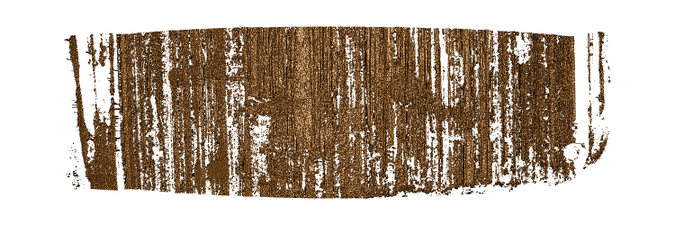

FAU154_BD_L2 (3 hits, Tiny Problems, Holes): Significant feathering across image.

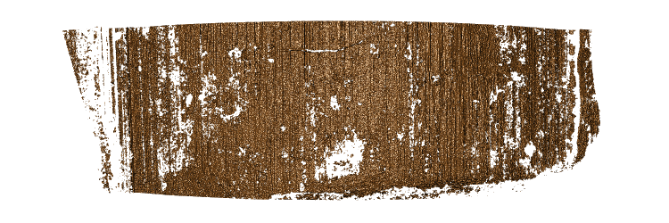

FAU204_BC_L4 (1 hits, Tiny Problems, Holes): Feathering on each end of image, rotational issues on left edge, holes in the center

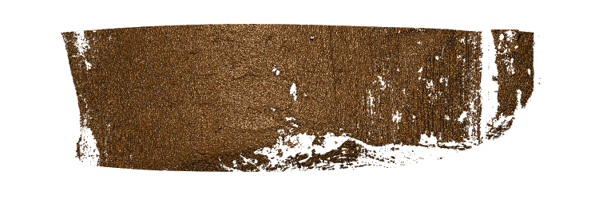

FAU254_BD_L4 (1 hits, Tiny Problems, Holes): Significant missing values on the bottom, holes across the center, missing section on right side.

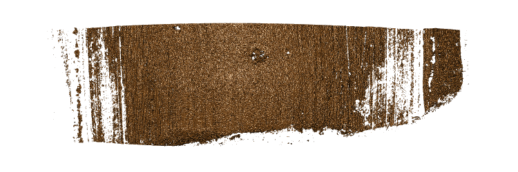

FAU263_BA_L4 (3 hits, Tiny Problems, Feathering): Significant feathering on right side image, missing most of the left, and many missing values on bottom 

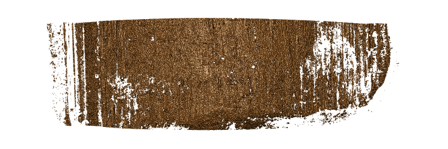

FAU263_BC_L1 (2 hits, Tiny Problems, Feathering): Significant feathering on right hand side, left side is missing most of the values, then feathering, then holes as it moves towards the middle. Bottom is also speckled with missing values.

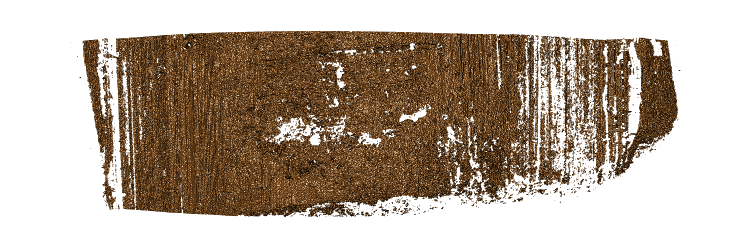

FAU263_BC_L3 (3 hits, Tiny Problems, Feathering): Contains significant feathering, holes, disproportionate edges and missing values at the bottom. 

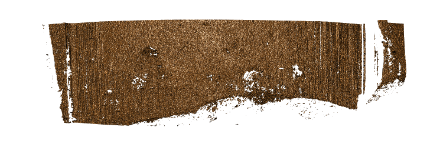

FAU275_BC_L5 (1 hits, Tiny Problems, Holes): 

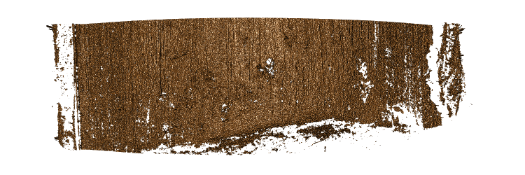

FAU275_BD_L3 (1 hits, Tiny Problems, Holes): 

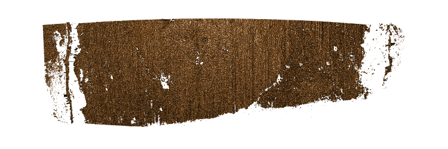

FAU277_BA_L4 (2 hits, Tiny Problems, Holes): A few holes, significant missing values on the left, right, and bottom.

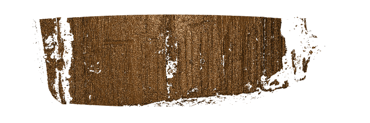

FAU286_BA_L5 (3 hits, Tiny Problems, Holes):

### Bibliography


- `r co("I found these on the Zotero, but I don't remember where to find the ID thing we discusses")` 

1. Hamby, J. E., Brundage, D. J., Petraco, N. D. K., & Thorpe, J. W. (2019). A Worldwide Study of Bullets Fired From 10 Consecutively Rifled 9MM RUGER Pistol Barrels—Analysis of Examiner Error Rate. Journal of Forensic Sciences, 64(2), 551–557. https://doi.org/10/gn65bd

2. Vanderplas, S., Nally, M., Klep, T., Cadevall, C., & Hofmann, H. (2020). Comparison of three similarity scores for bullet LEA matching. Forensic Science International, 110167. https://doi.org/10/gn6487

3. Gouwe, J., Hamby, J., & Norris, S. (2008). Comparison of 10,000 consecutively fired cartridge cases from a model 22 Glock. 40 S&W caliber semiautomatic pistol. AFTE JOURNAL, 40(1), 57.


