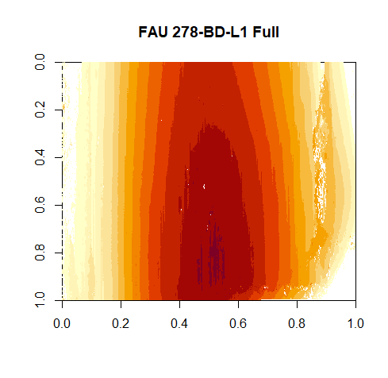
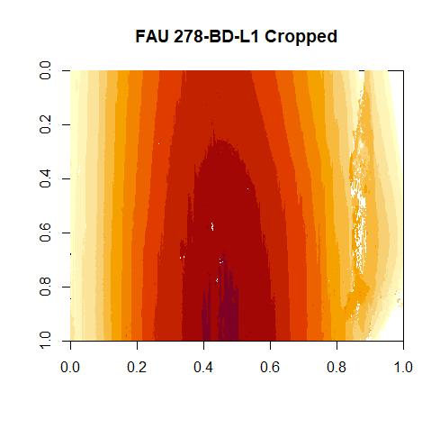

```{r setup, include=FALSE}
knitr::opts_chunk$set(echo = TRUE)
if (!require(fastDummies)) install.packages('fastDummies')
if (!require(tidyverse)) install.packages('tidyverse')
if (!require(ggplot2)) install.packages('ggplot2')
if (!require(RColorBrewer)) install.packages('RColorBrewer')
if (!require(ggpubr)) install.packages('ggpubr')
if (!require(yardstick)) install.packages('yardstick')
library(fastDummies)
library(tidyverse)
library(ggplot2)
library(RColorBrewer)
library(ggpubr)
library(yardstick)
theme_set(theme_bw())
## Load Functions - eventually we would like to just load a library

source("../R/comparison.R")
```

```{r data, echo=FALSE, cache=TRUE}
full_data = read.csv(file = "../data/std_and_cropped_data_12_20_2022.csv", header=TRUE)

# some prepping
full_data = full_data %>% mutate(
  Quality = factor(Quality, levels=c("Good", "Tiny Problems", "Problematic", "Bad", "Yikes")),
  Problem = factor(Problem),
  GoodScan = Quality %in% c("Good", "Tiny Problems") %>% factor(),
  LAPD_id = sprintf("FAU%3d-B%s-L%d",FAU, Bullet, Land)
)
```


# Comparison of features on Full and Cropped Scans

### TL;DR 

Extract NA, cropped is better.

Assess Bottomempty, cropped is better.

Assess Column Empty, cropped is slightly better.

Assess Median NA Proportion, full is better.

Upon investigation, all of the followup scans appeared to be "Tiny Problems" labelled and could reasonably be reclassified as "Problematic".

## Background and Introduction

This analysis is to compare the difference between the cropped versus non-cropped (full) version of a scan for quality identification. Cropped images have the potential for decreasing noise around the signal. The level of cropping we are considering is 5% from the left and right sides, and 10% off of the top of the image. In particular, we want to preserve the bottom of the image and the center as that is where most of the signal is. Below are examples of a full, and a cropped image.





## Features

xxx Overview of features with links (anchors)

XXX move mathematical definitions that you need for multiple features here. Give the definitions numbers or names and then refer to these definitions as needed below.

### Extract NA

The function `extract_na` calculates the percentage of missing values in the scan (part) under observation, e.g. for scan surface matrix $X \in {\rm I\!R}^{m, n}$ the percentage of missing values is defined as:

Let $A=\{NA\}$ be the set of undefined values. For simplicity of notation we will assume that the space of real values ${\rm I\!R}$ contains $A$:
${\rm I\!R}:= {\rm I\!R} \cup A$. 

With that, let $X \in {\rm I\!R}^{m,n}$ be a real-valued surface matrix of dimensions m x n where m and n are strictly positive integer values, $X = (x_{ij})_{1 \leq i \leq m, 1 \leq j \leq n}$ The proportion of missing values in X is then defined as: 
$$
\frac{1}{m*n} \sum^m_{i=1} \sum^n_{j=1} \theta_A(x_{ij}) \\
\text{Where } \theta_A(x) = \left\{\begin{aligned}
&1 &&: \text{if }x \in A\\
&0 &&: \text{otherwise}\\
\end{aligned} \right.
$$

### Which of the features is better for discriminating between good and bad scans?

```{r echo=FALSE}
cor(full_data$extract_na, full_data$extract_na_cropped)

res <- comparison(data.frame(full_data$extract_na, full_data$extract_na_cropped, full_data$Quality), feature = "Extract NA")

#res <- comparison(data.frame(full_data$assess_percentile_na_proportion, full_data$assess_percentile_na_proportion_cropped, full_data$Quality), feature = "Assess percentile NA proportion")

#res <- comparison(data.frame(full_data$assess_col_na, full_data$assess_col_na_cropped, full_data$Quality), feature = "assess col NA")
#res <- comparison(data.frame(full_data$assess_bottomempty, full_data$assess_bottomempty_cropped, full_data$Quality), feature = "Bottom Empty")
#res <- comparison(data.frame(full_data$assess_median_na_proportion, full_data$assess_median_na_proportion_cropped, full_data$Quality), feature = "Assess median NA proportion")

res$scatterplot + coord_equal()

res$boxplot

res$roc_curve

knitr::kable(res$summ, caption=attr(res$summ, "title"))

```
### Should we use features from just one type of scan or both?

```{r, echo=FALSE}
# logistic regression in the two features
logistic_base <- glm(GoodScan~extract_na+extract_na_cropped, data = full_data, family = binomial())
summary(logistic_base)

# extract_na_cropped is the better single predictor. 
full_data %>% pivot_longer(starts_with("extract_na"), names_to="Scan") %>% 
  ggplot(aes(x = value, fill=GoodScan, color=GoodScan)) + geom_density(alpha=0.8) + scale_fill_manual(values=col_scans_light) + scale_colour_manual(values=col_scans_dark) +
  facet_grid(.~Scan)
```


### Conclusion for Extract NA

The values for feature `extract_NA` are highly correlated between the cropped and the full scan. 

Using good and scans with only tiny problems as overall 'good' scans, the feature applied to cropped scans has an increased accuracy compared to the feature values from the full scan. 

We might want to follow up on the orange colored scans:

```{r echo=FALSE, fig.height=3}
full_data  <- full_data %>% 
  mutate(followup=GoodScan=="TRUE" & extract_na_cropped>15)
full_data %>% 
  ggplot(aes(x = extract_na_cropped, y = GoodScan, color = followup)) + 
  geom_jitter() +
  scale_colour_manual(values=c("grey50", "darkorange"))
```
```{r}


full_data$LAPD_id[full_data$followup]
# All followups for extract_na are mislabelled scans. They are all labelled as tiny problems but should be problematic or worse.
```

```{r, include = FALSE, eval = FALSE}
library(x3ptools)
# /media/Raven/LAPD
f1 <- x3p_read("/media/Raven/LAPD/FAU 263/Bullet A/LAPD - 263 - Bullet A - Land 4 - Sneox2 - 20x - auto light left image + 20% - threshold 2 - resolution 4 - Connor Hergenreter.x3p")
# FAU263-BA-L4 is labelled tiny-problems but should be labelled Problematic or worse

f2 <- x3p_read("/media/Raven/LAPD/FAU 263/Bullet C/LAPD - 263 - Bullet C - Land 1 - Sneox2 - 20x - auto light left image + 20% - threshold 2 - resolution 4 - Connor Hergenreter.x3p")
# FAU263-BC-L1 is labelled tiny-problems but should be labelled Problematic or worse

f3 <- x3p_read("/media/Raven/LAPD/FAU 263/Bullet C/LAPD - 263 - Bullet C - Land 3 - Sneox2 - 20x - auto light left image + 20% - threshold 2 - resolution 4 - Connor Hergenreter.x3p")
# FAU263-BC-L3 is labelled tiny-problems but should be labelled Problematic or worse

f4 <- x3p_read("/media/Raven/LAPD/FAU 287/Bullet C/LAPD - 287 - Bullet C - Land 5 - Sneox1 - 20x - auto light left image + 20% - threshold 2 - resolution 4 - Connor Hergenreter.x3p")
# FAU287-BC-L5 is labelled tiny-problems but should be labelled Problematic or worse

f5 <- x3p_read("/media/Raven/LAPD/FAU 154/Bullet D/LAPD - 154 - Bullet D - Land 2 - Sneox2 - 20x - auto light left image + 20% - threshold 2 - resolution 4 - Carley McConnell.x3p")
# FAU154-BD-L2 is labelled tiny-problems but should be labelled Problematic or worse

f6 <- x3p_read("/media/Raven/LAPD/FAU 277/Bullet A/LAPD - 277 - Bullet A - Land 4 - Sneox2 - 20x - auto light left image + 20% - threshold 2 - resolution 4 - Connor Hergenreter.x3p")
# FAU277-BA-L4 is labelled tiny-problems but should be labelled Problematic or worse

f7 <- x3p_read("/media/Raven/LAPD/FAU 286/Bullet A/LAPD - 286 - Bullet A - Land 5 - Sneox1 - 20x - auto light left image + 20% - threshold 2 - resolution 4 - Connor Hergenreter.x3p")
# FAU286-BA-L5 is labelled tiny-problems but should be labelled Problematic or worse
```


## Assess Bottomempty

The feature `assess_bottomempty` calculates the percentage of missing values in the bottom 20% of the scan. 

Let $A=\{NA\}$ be the set of undefined values. For simplicity of notation we will assume that the space of real values ${\rm I\!R}$ contains $A$:
${\rm I\!R}:= {\rm I\!R} \cup A$. 

With that, let $X \in R^{m,n}$ be a real-valued surface matrix of dimensions m x n where m and n are strictly positive integers $X = (x_{ij})_{1 \leq i \leq m, 1 \leq j \leq n}$.

Let $R \subseteq {\rm I\!R}$ be a set of size m, where each element is the sum of the NA's for the given row, defined as:
$$
\forall i \in R: R_i = \sum^n_{j=1} \theta_A(x_{ij}) \\
\text{Where } \theta_A(x) = \left\{\begin{aligned}
&1 &&: \text{if }x \in A\\
&0 &&: \text{otherwise}\\
\end{aligned} \right.
$$

Let $B \subset R$ be a set, which is the set of all values in $R_i$, given that $i \geq m*0.8$. Therefore, the proportion of missing values in $X$'s bottom 20% can be given by:
$$
\frac{1}{m*n*0.2}\sum_{i=1}^{m*0.2}(R_i)*100
$$

### Which of the features is better for discriminating between good and bad scans?

```{r echo=FALSE}
cor(full_data$assess_bottomempty, full_data$assess_bottomempty_cropped)

res <- comparison(data.frame(full_data$assess_bottomempty, full_data$assess_bottomempty_cropped, full_data$Quality), feature = "Assess Bottomempty")
res$scatterplot + coord_equal()

res$boxplot

res$roc_curve

knitr::kable(res$summ, caption=attr(res$summ, "title"))

```
### Should we use features from just one type of scan or both?

```{r, echo=FALSE}
# logistic regression in the two features
logistic_base <- glm(GoodScan~assess_bottomempty+assess_bottomempty_cropped, data = full_data, family = binomial())
summary(logistic_base)

# assess_bottomempty_cropped is the better single predictor. 
full_data %>% pivot_longer(starts_with("assess_bottomempty"), names_to="Scan") %>% 
  ggplot(aes(x = value, fill=GoodScan, color=GoodScan)) + geom_density(alpha=0.8) + scale_fill_manual(values=col_scans_light) + scale_colour_manual(values=col_scans_dark) +
  facet_grid(.~Scan)
```


### Conclusion for Assess Bottomempty

The values for feature `assess_bottomempty` are highly correlated between the cropped and the full scan. 

Using good and scans with only tiny problems as overall 'good' scans, the feature applied to cropped scans has an increased accuracy compared to the feature values from the full scan. 

We might want to follow up on the orange colored scans:

```{r echo=FALSE, fig.height=3}
full_data  <- full_data %>% 
  mutate(followup=GoodScan=="TRUE" & assess_bottomempty_cropped>30)
full_data %>% 
  ggplot(aes(x = assess_bottomempty_cropped, y = GoodScan, color = followup)) + 
  geom_jitter() +
  scale_colour_manual(values=c("grey50", "darkorange"))
```
```{r}
followup <- full_data$LAPD_id[full_data$followup]
```

```{r, include = FALSE, eval = FALSE}
# All problems are registered as tiny problems
followup <- c("FAU263-BA-L4", "FAU287-BC-L5", "FAU254-BD-L4", "FAU275-BC-L5", "FAU275-BD-L3", "FAU277-BA-L4", "FAU286-BA-L5")
f1 <- x3p_read("/media/Raven/LAPD/FAU 263/Bullet A/LAPD - 263 - Bullet A - Land 4 - Sneox2 - 20x - auto light left image + 20% - threshold 2 - resolution 4 - Connor Hergenreter.x3p")
image(f1, main=followup[1])

f2 <- x3p_read("/media/Raven/LAPD/FAU 287/Bullet C/LAPD - 287 - Bullet C - Land 5 - Sneox1 - 20x - auto light left image + 20% - threshold 2 - resolution 4 - Connor Hergenreter.x3p")
image(f2, main=followup[2])

f3 <- x3p_read("/media/Raven/LAPD/FAU 254/Bullet D/LAPD - 254 - Bullet D - Land 4 - Sneox2 - 20x - auto light left image +20% - threshold 2 - resolution 4 - Connor Hergenreter.x3p")
image(f3, main=followup[3])

f4 <- x3p_read("/media/Raven/LAPD/FAU 275/Bullet C/LAPD - 275 - Bullet C - Land 5 - Sneox2 - 20x - auto light left image + 20% - threshold 2 - resolution 4 - Connor Hergenreter.x3p")
image(f4, main=followup[4])

f5 <- x3p_read("/media/Raven/LAPD/FAU 275/Bullet D/LAPD - 275 - Bullet D - Land 3 - Sneox2 - 20x - auto light left image + 20% - threshold 2 - resolution 4 - Connor Hergenreter.x3p")
image(f5, main=followup[5])

f6 <- x3p_read("/media/Raven/LAPD/FAU 277/Bullet A/LAPD - 277 - Bullet A - Land 4 - Sneox2 - 20x - auto light left image + 20% - threshold 2 - resolution 4 - Connor Hergenreter.x3p")
image(f6, main=followup[6])

f7 <- x3p_read("/media/Raven/LAPD/FAU 286/Bullet A/LAPD - 286 - Bullet A - Land 5 - Sneox1 - 20x - auto light left image + 20% - threshold 2 - resolution 4 - Connor Hergenreter.x3p")
image(f7, main=followup[7])

```


## Assess Col NA

The function `assess_col_na` calculates the percentage of missing values 

For every column in the matrix of a scan, we find the proportion of scans in that column which are NA. Then we count how many of the columns whose proportion is greater than 20%, the pre-determined threshold of acceptable NA's. Then we divide by the number of columns * 0.2 to get our final threshold adjusted number. 

Let $A=\{NA\}$ be the set of undefined values. For simplicity of notation we will assume that the space of real values ${\rm I\!R}$ contains $A$:
${\rm I\!R}:= {\rm I\!R} \cup A$. 

With that, let $X \in R^{m,n}$ be a real-valued surface matrix of dimensions m x n where m and n are strictly positive integers $X = (x_{ij})_{1 \leq i \leq m, 1 \leq j \leq n}$.

Let $R \subseteq {\rm I\!R}$ be a set of size n, where each element is the sum of the NA's for the given column, defined as:
$$
\forall i \in R: R_i = \sum^m_{j=1} \theta_A(x_{ij}) \\
\text{Where } \theta_A(x) = \left\{\begin{aligned}
&1 &&: \text{if }x \in A\\
&0 &&: \text{otherwise}\\
\end{aligned} \right.
$$

We define $P$ as the proportion of all NAs per column for every row, as defined here:
$$
\forall i \in R: P_i = \frac{R_i}{n} * 100
$$

We now find the proportion of threshold adjusted columns in the matrix 
$$
\frac{\sum_{i=1}^n(P_i*\beta_B(P_i))}{n*0.2} \\
\text{Where } \beta_B(x) = \left\{\begin{aligned}
&1 &&: \text{if }x > 20\\
&0 &&: \text{otherwise}\\
\end{aligned} \right.
$$

### Which of the features is better for discriminating between good and bad scans?

```{r echo=FALSE}
cor(full_data$assess_col_na, full_data$assess_col_na_cropped)

res <- comparison(data.frame(full_data$assess_col_na, full_data$assess_col_na_cropped, full_data$Quality), feature = "Assess Col NA")

res$scatterplot + coord_equal()

res$boxplot

res$roc_curve

knitr::kable(res$summ, caption=attr(res$summ, "title"))

```
### Should we use features from just one type of scan or both?

```{r, echo=FALSE}
# logistic regression in the two features
logistic_base <- glm(GoodScan~assess_col_na+assess_col_na_cropped, data = full_data, family = binomial())
summary(logistic_base)

# Both predictors are about the same.
full_data %>% pivot_longer(starts_with("assess_col_na"), names_to="Scan") %>% 
  ggplot(aes(x = value, fill=GoodScan, color=GoodScan)) + geom_density(alpha=0.8) + scale_fill_manual(values=col_scans_light) + scale_colour_manual(values=col_scans_dark) +
  facet_grid(.~Scan)
```


### Conclusion for Assess Col NA

The values for feature `assess_col_na` are highly correlated between the cropped and the full scan. 

Using good and scans with only tiny problems as overall 'good' scans, the feature applied to cropped scans has an increased accuracy compared to the feature values from the full scan. 

We might want to follow up on the orange colored scans:

```{r echo=FALSE, fig.height=3}
full_data  <- full_data %>% 
  mutate(followup=GoodScan=="TRUE" & assess_col_na_cropped>1.35)
full_data %>% 
  ggplot(aes(x = assess_col_na_cropped, y = GoodScan, color = followup)) + 
  geom_jitter() +
  scale_colour_manual(values=c("grey50", "darkorange"))
```
```{r}
full_data$LAPD_id[full_data$followup]
```

```{r, include = FALSE, eval = FALSE}
followup <- data.frame(LAPD_ID = c("FAU263-BA-L4", "FAU263-BB-L3", "FAU263-BC-L1", "FAU263-BC-L3", "FAU154-BD-L2", "FAU286-BA-L5"), filePAth = c("/media/Raven/LAPD/FAU 263/Bullet A/LAPD - 263 - Bullet A - Land 4 - Sneox2 - 20x - auto light left image + 20% - threshold 2 - resolution 4 - Connor Hergenreter.x3p", "/media/Raven/LAPD/FAU 263/Bullet B/LAPD - 263 - Bullet B - Land 3 - Sneox2 - 20x - auto light left image + 20% - threshold 2 - resolution 4 - Connor Hergenreter.x3p", "/media/Raven/LAPD/FAU 263/Bullet C/LAPD - 263 - Bullet C - Land 1 - Sneox2 - 20x - auto light left image + 20% - threshold 2 - resolution 4 - Connor Hergenreter.x3p", "/media/Raven/LAPD/FAU 263/Bullet C/LAPD - 263 - Bullet C - Land 3 - Sneox2 - 20x - auto light left image + 20% - threshold 2 - resolution 4 - Connor Hergenreter.x3p", "/media/Raven/LAPD/FAU 154/Bullet D/LAPD - 154 - Bullet D - Land 2 - Sneox2 - 20x - auto light left image + 20% - threshold 2 - resolution 4 - Carley McConnell.x3p"  , "/media/Raven/LAPD/FAU 286/Bullet A/LAPD - 286 - Bullet A - Land 5 - Sneox1 - 20x - auto light left image + 20% - threshold 2 - resolution 4 - Connor Hergenreter.x3p"))

for (i in 1:nrow(followup)) {
  f <- x3p_read(followup[i,2])
  image(f, main=followup[i,1])
}
```

## Assess Median NA Proportion

The function `assess_median_na_proportion` calculates the mean number of NA's in each column, and then finds the median out of all those values.

Let $A=\{NA\}$ be the set of undefined values. For simplicity of notation we will assume that the space of real values ${\rm I\!R}$ contains $A$:
${\rm I\!R}:= {\rm I\!R} \cup A$. 

With that, let $X \in R^{m,n}$ be a real-valued surface matrix of dimensions m x n where m and n are strictly positive integers $X = (x_{ij})_{1 \leq i \leq m, 1 \leq j \leq n}$.

Let $R \subseteq {\rm I\!R}$ be a set of size n, where each element is the mean of the NA's for the given column, defined as:
$$
\forall i \in R: R_i = \frac{\sum^m_{j=1} \theta_A(x_{ij})}{m} \\
\text{Where } \theta_A(x) = \left\{\begin{aligned}
&1 &&: \text{if }x \in A\\
&0 &&: \text{otherwise}\\
\end{aligned} \right.
$$

We then sort, and select the median of $R$

### Which of the features is better for discriminating between good and bad scans?

```{r echo=FALSE}
cor(full_data$extract_na, full_data$extract_na_cropped)


res <- comparison(data.frame(full_data$assess_median_na_proportion, full_data$assess_median_na_proportion_cropped, full_data$Quality), feature = "Assess median NA proportion")

res$scatterplot + coord_equal()

res$boxplot

res$roc_curve

knitr::kable(res$summ, caption=attr(res$summ, "title"))

```
### Should we use features from just one type of scan or both?

```{r, echo=FALSE}
# logistic regression in the two features
logistic_base <- glm(GoodScan~assess_median_na_proportion+assess_median_na_proportion_cropped,
                     data = full_data, family = binomial())
summary(logistic_base)

# assess_median_na_proportion is the better single predictor. 
full_data %>% pivot_longer(starts_with("assess_median_na_proportion"), names_to="Scan") %>% 
  ggplot(aes(x = value, fill=GoodScan, color=GoodScan)) + geom_density(alpha=0.8) + scale_fill_manual(values=col_scans_light) + scale_colour_manual(values=col_scans_dark) +
  facet_grid(.~Scan)
```


### Conclusion for Assess Median NA Proportion

The values for feature `extract_NA` are highly correlated between the cropped and the full scan. 

Using good and scans with only tiny problems as overall 'good' scans, the feature applied to full scans has an increased accuracy compared to the feature values from the cropped scan. 

We might want to follow up on the orange colored scans:

```{r echo=FALSE, fig.height=3}
full_data  <- full_data %>% 
  mutate(followup=GoodScan=="TRUE" & assess_median_na_proportion>0.095)
full_data %>% 
  ggplot(aes(x = assess_median_na_proportion, y = GoodScan, color = followup)) + 
  geom_jitter() +
  scale_colour_manual(values=c("grey50", "darkorange"))
```
```{r}
full_data$LAPD_id[full_data$followup]
```
```{r, include = FALSE, eval = FALSE}
followup <- data.frame(LAPD_ID = c("FAU263-BC-L3", "FAU154-BD-L2", "FAU204-BC-L4"), filePAth = c("/media/Raven/LAPD/FAU 263/Bullet C/LAPD - 263 - Bullet C - Land 3 - Sneox2 - 20x - auto light left image + 20% - threshold 2 - resolution 4 - Connor Hergenreter.x3p", "/media/Raven/LAPD/FAU 154/Bullet D/LAPD - 154 - Bullet D - Land 2 - Sneox2 - 20x - auto light left image + 20% - threshold 2 - resolution 4 - Carley McConnell.x3p", "/media/Raven/LAPD/FAU 204/Bullet C/LAPD - 204 - Bullet C - Land 4 - Sneox1 - 20x - auto light left image + 20% - threshold 2 - resolution 4 - Connor Hergenreter.x3p"))

for (i in 1:nrow(followup)) {
  f <- x3p_read(followup[i,2])
  image(f, main=followup[i,1])
}
# all should be relabbeled, FAU 204, BC, L4 is particularly Yikes looking
```


```{r}
# Test Zone
```
